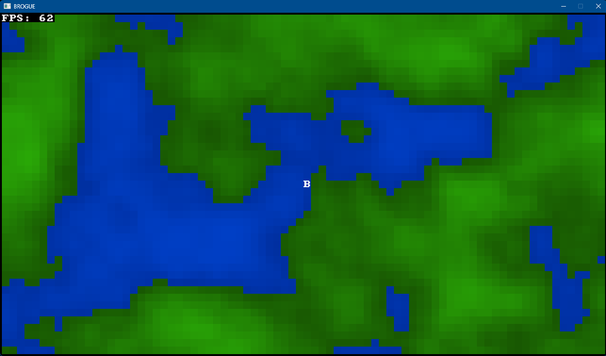

# BROGUE 

A small project created in Rust, emulating the terminal-look by rendering a grid of characters in the window using the `bracket-lib` crate. I am hoping to develop this further into something actually playable, but for now it's just an experiment.

## Instructions

1. clone repo with `git clone https://github.com/alefnull/BROGUE`
2. enter `BROGUE` directory
3. use `cargo run` to build and run the application.

- use WASD to move the 'player' around within the bounds of the window.
- press `<space>` to generate a new background 'map'
- press `Q` or `<escape>` to exit

